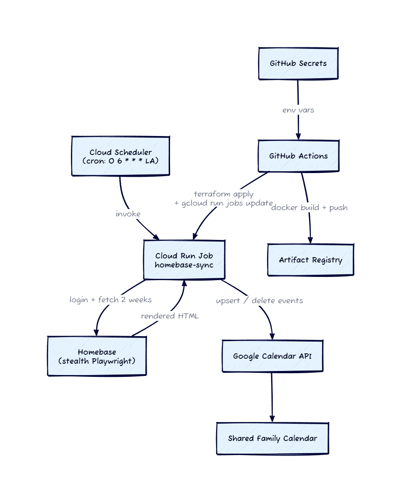

# homebase-gcal-integration

I built this so my husband Emilio doesn't have to manually re-enter his Homebase shifts into our shared family Google Calendar every week. It logs into Homebase as him, scrapes the team schedule, parses out his shifts, and upserts them into our calendar. Runs on a daily cron in GCP.

## What it does

Scrapes `app.joinhomebase.com/schedule/employee/week/<monday>` for the current and next week, then routes each employee's shifts to a per-employee Google Calendar based on `employees.toml`. Idempotent: each Homebase shift maps to a deterministic GCal event ID (`homebase<shift_id>`), so re-runs just update in place. Removed shifts get deleted via a window-scoped diff pass.

## Architecture



<details>
<summary>D2 source (edit + re-export to update the PNG)</summary>

```d2
direction: down

scheduler: Cloud Scheduler\n(cron: 0 6 * * * LA)
job: Cloud Run Job\nhomebase-sync
homebase: Homebase\n(stealth Playwright)
gcal: Google Calendar API
fam_cal: Shared Family Calendar

scheduler -> job: invoke
job -> homebase: login + fetch 2 weeks
homebase -> job: rendered HTML
job -> gcal: upsert / delete events
gcal -> fam_cal

gh: GitHub Actions
secrets: GitHub Secrets
ar: Artifact Registry

gh -> ar: docker build + push
secrets -> gh: env vars
gh -> job: terraform apply\n+ gcloud run jobs update
```

Render with `d2 architecture.d2 architecture.png` (CLI: `brew install d2`) or paste at <https://play.d2lang.com>.

</details>

## Local development

### Prerequisites

- Python 3.11 or later (pyenv: `pyenv install 3.13.1 && pyenv local 3.13.1`)
- Google Cloud project with Calendar API enabled
- `gcloud auth application-default login` completed (local auth)
- Homebase employee account
- Each target calendar shared with your Google account (or with the Cloud Run runtime SA in production), permission "Make changes to events"

### Setup

```bash
python -m venv .venv
.venv/Scripts/python.exe -m pip install -e ".[dev]"
.venv/Scripts/python.exe -m playwright install chromium
cp .env.example .env  # then fill in HOMEBASE_EMAIL, HOMEBASE_PASSWORD
```

Edit `employees.toml` with your `name = "..."` (must exactly match the Homebase grid display name) and `calendar_id`.

### Run tests

```bash
.venv/Scripts/python.exe -m pytest
.venv/Scripts/python.exe -m ruff check .
.venv/Scripts/python.exe -m black --check .
```

### Verify calendar access

Confirms ADC can list events on every calendar in `employees.toml`:

```bash
.venv/Scripts/python.exe scripts/bootstrap_oauth.py
```

If it reports `[FAIL]` for any calendar, share that calendar with the principal you're authenticated as.

### Smoke test (scrape only, no GCal writes)

```bash
.venv/Scripts/python.exe scripts/smoke_scrape.py --headed --dump
```

`--headed` shows the browser. `--dump` writes raw HTML to `scripts/_dumps/` for debugging.

### Full pipeline (scrape + sync)

```bash
.venv/Scripts/python.exe scripts/smoke_sync.py --dry-run   # parses, no GCal writes
.venv/Scripts/python.exe scripts/smoke_sync.py             # writes events to your calendars
```

## Deployment

GCP infra is managed in [`infra/`](infra/) (Terraform). CI/CD lives in [`.github/workflows/`](.github/workflows/):

- `test.yml`: ruff, black, pytest on every push/PR
- `security.yml`: semgrep, pip-audit
- `tf-plan.yml`: posts `terraform plan` as a PR comment when `infra/**` changes
- `deploy.yml`: builds the container, runs `terraform apply`, sets env vars on the Cloud Run Job from GH Secrets

Required GitHub Secrets: `GCP_WORKLOAD_IDENTITY_PROVIDER`, `GCP_DEPLOYER_SA`, `HOMEBASE_EMAIL`, `HOMEBASE_PASSWORD`, `EMPLOYEES_CONFIG_TOML`. (No GCal credentials needed; the Cloud Run runtime SA authenticates via ADC.)

## Project layout

```text
src/homebase_sync/
  __main__.py        # production entrypoint
  config.py          # env + employees.toml loader
  scraper.py         # Playwright login + weekly fetch
  parser.py          # HTML to Shift dataclass
  calendar_sync.py   # OAuth, upsert, delete-diff
  time_utils.py      # "2pm-8pm" parsing, week math
  models.py          # Shift dataclass
scripts/             # bootstrap_oauth, smoke_scrape, smoke_sync
tests/               # pytest, fixture HTML
infra/               # Terraform: Cloud Run Job, Scheduler, OIDC, IAM
.github/workflows/   # CI/CD
```
